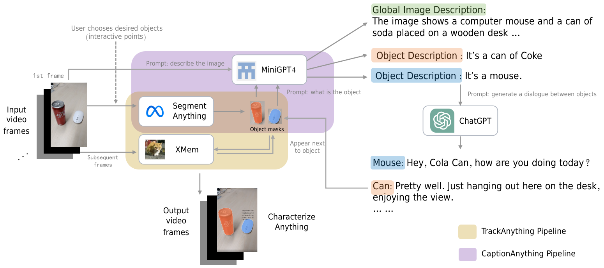

<div align=center></div>

# Characterize Anything

Imagine a world where every object around you springs to life. Meet your favorite mug of coffee, chat with your fridge, befriend your sofa.🤩

***Characterize Anything*** is an inspirational interactive tool for characterizing any inanimate object in a video/image so that users could talk with. It combines the power of SOTA video object tracking & segmentation, and large vision language models in order to bring any object to life. Besides, one could specify which object(s) to talk to via simple mouse clicks on a given image or video.

(This project is still under active development to make it into an amazing product.💪)

## 1) Background

There are already various [Awesome-Anything](https://github.com/VainF/Awesome-Anything) projects in the community, and "characterize anything" would like to join the family.

**💡 How does this idea come out?**

> TLDR: A wondrous chemical reaction between vision language models and AI Characters

<details><summary> We'd like to inspire </summary>

- We've long been fascinated by the idea of AI-driven characters / avatars (both UGC and PGC ones). [Character.ai](https://beta.character.ai/) is one of the best places where you could get an interesting experience.
- Foundation vision  models (e.g., [Segment Anything](https://github.com/facebookresearch/segment-anything)) are amazing
- Foundation language models (e.g., ChatGPT) are amazing.
- There are awesome preliminary open-source projects that we could base on (e.g., [Track-Anything](https://github.com/gaomingqi/Track-Anything)).
- Inspirai inspires people.

</details>

**🌟 What are potential applications?**

> TLDR: **Education**, **Entertainment**, **Attraction**

<details>
<summary>ChatGPT has a lot to say!</summary>
<br>
Well, we ask ChatGPT to help us with the answer (Basically we ask it to write advertisement for the concept).

- ToC: For kids

> ChatGPT: Are your kids curious little explorers, always eager to learn about new things? Well, have no fear, because "characterize anything" is here! Your kiddos can now chat it up with any object they want to learn about, ask all their burning questions, and maybe even make some new pals along the way. Imagination and curiosity will reach an all-time high with this awesome concept. So who knows? Maybe your child will even become besties with the living room lamp or have a heart-to-heart with the kitchen sink. The possibilities are endless!

- ToC: For Adults

Checkout some videos for fun: [Youtube | If Objects Could Talk!? | Brent Rivera](https://www.youtube.com/watch?v=i0invZZ_6aY)

> ChatGPT: Grown-ups, are you tired of the same old boring conversations with inanimate objects? Do you dread talking to your houseplants because they never seem to talk back? Well, fear not! The amazing concept of "characterize anything" is not just for kids anymore. Yes, you can now have meaningful conversations with your favorite household items or even your car. Did you ever think you'd bond with your fridge over your mutual love of cheese? Or have a heated debate with your computer about which is better, Apple or Windows? The possibilities are endless, and with "characterize anything," you'll never feel alone in a room again. So go ahead, channel your inner child and start talking to your lamp. You might just learn something new about each other.

- ToB

> ChatGPT: Attention! Are you tired of the same old boring sales and marketing pitches? Do you want to revolutionize the way you connect with your customers? Look no further than "characterize anything"! With this unique concept, you can bring your products and services to life in a whole new way. Imagine your customers being able to engage in conversations with your products, asking questions, and getting to know them on a deeper level. Your products will no longer be just inanimate objects, but characters with personalities and stories to share. Plus, this innovative approach to customer engagement is sure to set your business apart from the competition. So why not give "characterize anything" a try and let your customers get to know your products like never before? They'll be hooked in no time!

</details>

## 2) Demo

We currently offer two types of demos based on Gradio: 

1. **Interactive Static Demo**
   
   - You can input an image and select the object you want to converse with. Once you've made your selection, you can start the conversation.
   - If you wish to converse with another object, simply click on it and the conversation will restart.

2. **Self-Chat Video Demo**

   - You can input a video and select at least two objects that you would like to bring to life (at the first frame). ChatGPT will then imagine a conversation between the selected objects in a creative way.
   - The output would be the original video with dialogue lines added and stick to objects

### 2.1) Interactive Static Demo

| English                                           | Chinese                                           |
|---------------------------------------------------|---------------------------------------------------|
|  |  |

### 2.2) Self-Chat Video Demo

| English Demo                                                                                                        | Chinese Demo                                                                                                        |
|---------------------------------------------------------------------------------------------------------------------|---------------------------------------------------------------------------------------------------------------------|
| <video src="https://github.com/inspirai/Characterize-Anything/assets/11401434/f75a2de8-31cb-40c5-8f7a-94ad5e998d9f"> | <video src="https://github.com/inspirai/Characterize-Anything/assets/11401434/dcf575cd-697c-43fe-a241-46b7a69ca803"> |


## 3) System Architecture

The self-chat demo pipeline is illustrated as follows:

<div align=center>

</div>

Basically, the self-chat video pipeline is consisted of the following steps:

- Input: A video containing desired objects
- Visual Control: User clicks on objects that participate in character conversation 
- Caption Anything: Perform different level of image captions for the 1st frame
- ChatGPT: Generate a creative conversation between characters based on captions
- Track Anything: Perform video tracking & segmentation based on SAM and XMem models
- Output: The original video but with dialogue lines added and stick to objects

### 3.1) Limitations

We'd like to list some major limitations below:

- Pipeline complexity

  Currently, our pipeline is a mixture of multiple projects and models, which already seems complex and less end-to-end.

- Shot changes are not handled

  We only support simple scenarios where objects won't change much in a video. In real scenarios however, it's common that there could be multiple shot changes during a video (e.g., an object could disappear), hence shot change detection with image caption regeneration from time to time are probably needed.

- Manual controls are still needed

  The duration of each conversation turn is manually set (e.g., how many frames does a dialogue turn takes up) instead of automatically decided

  The location of dialogue contents are manually set (e.g., texts appear always above the objects)

## 4) 🎓 Tutorials

### 4.1) Get Started
    
```bash
git clone git@github.com:inspirai/Characterize-Anything.git
cd Characterize-Anything

# Install dependencies: 
conda env create -f environment.yml

# Run the Characterize-Anything gradio demo.
python characterize_anything_app.py --device cuda:0 --port xx  # (video: self chat mode)
python characterize_anything_image_app.py --device cuda:0 --port xx  # (image: interactive chat mode)

# --sam_model_type vit_b 
    # for lower memory usage
# --checkpoints_dir local_dir 
    # for local checkpoints directory which contains the following ckpts:
        # - sam_vit_h_4b8939.pth (https://dl.fbaipublicfiles.com/segment_anything/sam_vit_h_4b8939.pth)
        # - XMem-s012.pth (https://github.com/hkchengrex/XMem/releases/download/v1.0/XMem-s012.pth)
        # - E2FGVI-HQ-CVPR22.pth (https://drive.google.com/uc?id=10wGdKSUOie0XmCr8SQ2A2FeDe-mfn5w3)
```

### 4.2) Recipes

We'd like to share some experiences that are more or less related to our project.

- [Recipe for building lore-friendly characters using ChatGPT](tutorials/recipe_building_lore_friendly_characters.md)


## 5) Acknowledgement

We appreciate the open source of the following preliminary projects:

- [Segment Anything](https://github.com/facebookresearch/segment-anything) is a strong segmentation foundation model that supports diverse prompts.

- [Track Anything](https://github.com/gaomingqi/Track-Anything) combines SAM with XMem for high-performance object tracking and segmentation in videos.

- [Caption Anything](https://github.com/ttengwang/Caption-Anything) combines SAM with vision language models in order to caption any object.

- [Langchain](https://github.com/hwchase17/langchain/tree/master) is a framework for developing applications powered by language models.

Also, we used [Midjourney](https://www.midjourney.com) for creating our Pixar-style logo image 🤗 We thank Pixar for their incredible animation movies!
